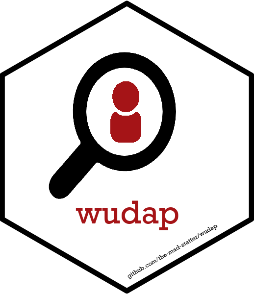

<!-- README.md is generated from README.Rmd. Please edit that file -->

# wudap 

<!-- badges: start -->

[](https://www.repostatus.org/#wip)
[](https://lifecycle.r-lib.org/articles/stages.html#experimental)
[](https://github.com/the-mad-statter/wudap)
[-blue.svg)](https://cran.r-project.org/web/licenses/GPL%20(%3E=%203))
<br />
[](https://github.com/the-mad-statter/wudap/commits/main)
[](https://github.com/the-mad-statter/wudap/actions/workflows/style.yaml)
[](https://github.com/the-mad-statter/wudap/actions/workflows/lint.yaml)
[](https://github.com/the-mad-statter/wudap/actions/workflows/R-CMD-check.yaml)
<!-- badges: end -->

## Overview

The R package `wudap` is an LDAP Client in R for Washington University
in Saint Louis.

<br />

## Installation

You can install `wudap` from
[GitHub](https://github.com/the-mad-statter/wudap) with:

``` r
pak::pkg_install("the-mad-statter/wudap")
```

If you manage your own Python environment, you may also have to install
the [ldap3](https://ldap3.readthedocs.io/en/latest/) Python library:

``` r
reticulate::py_install("ldap3")
```

<br />

## Usage

``` r
library(wudap)

wudap_connect() |>
  wudap_search(
    search_filter = "(sn=Bear)",
    attributes = c("sn", "givenName", "personalTitle")
  ) |>
  as_tibble()
```

<br />

## Code of Conduct

Please note that the wudap project is released with a [Contributor Code
of
Conduct](https://contributor-covenant.org/version/2/0/CODE_OF_CONDUCT.html).
By contributing to this project, you agree to abide by its terms.

<br />

## Code Style

This package attempts to follow the [tidyverse style
guide](https://style.tidyverse.org/index.html).

The use of [{styler}](https://github.com/r-lib/styler) and
[{lintr}](https://github.com/r-lib/lintr) are recommended.

<br />

## About

### Washington University in Saint Louis 

Established in 1853, [Washington University in Saint
Louis](https://www.wustl.edu) is among the world’s leaders in teaching,
research, patient care, and service to society. Boasting 24 Nobel
laureates to date, the University is ranked 7th in the world for most
cited researchers, received the 4th highest amount of NIH medical
research grants among medical schools in 2019, and was tied for 1st in
the United States for genetics and genomics in 2018. The University is
committed to learning and exploration, discovery and impact, and
intellectual passions and challenging the unknown.
